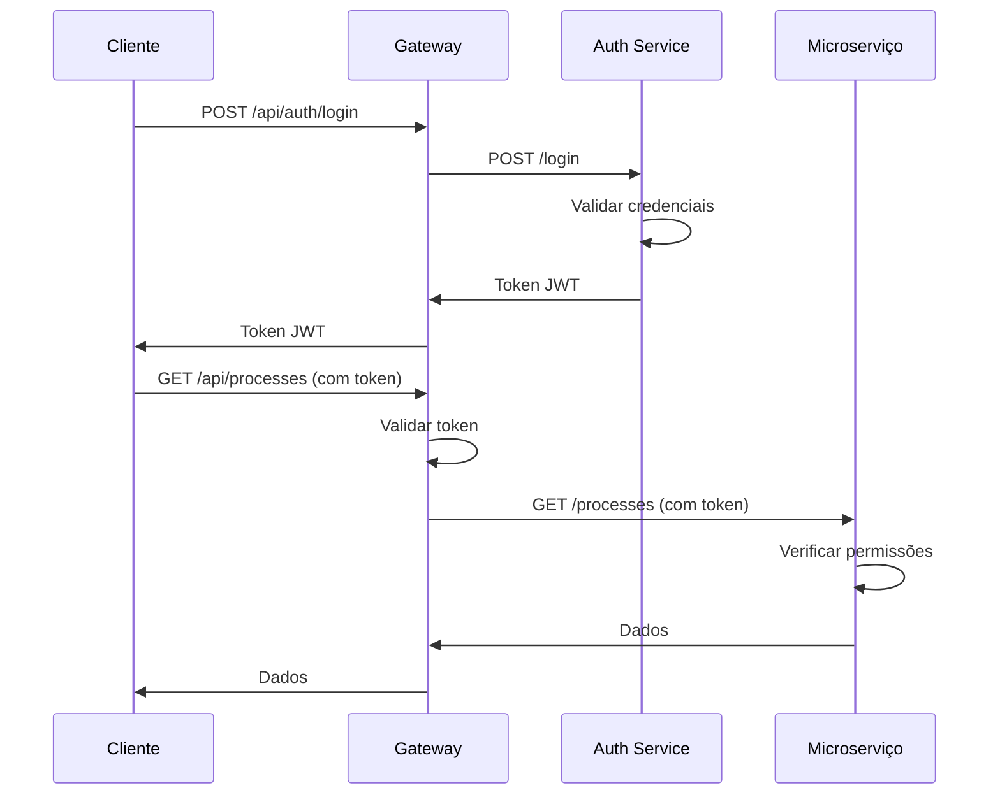

# Documentação Completa do Backend - Sistema de Microserviços

## 📋 Índice

1. [Visão Geral](#visão-geral)
2. [Arquitetura do Sistema](#arquitetura-do-sistema)
3. [Estrutura de Diretórios](#estrutura-de-diretórios)
4. [Gateway API](#gateway-api)
5. [Microserviços](#microserviços)
6. [Módulos Compartilhados](#módulos-compartilhados)
7. [Autenticação e Autorização](#autenticação-e-autorização)
8. [Validação de Dados](#validação-de-dados)
9. [Estrutura de Dados](#estrutura-de-dados)
10. [Endpoints da API](#endpoints-da-api)
11. [Segurança](#segurança)
12. [Como Executar](#como-executar)
13. [Testes](#testes)
14. [Troubleshooting](#troubleshooting)

---

## 🎯 Visão Geral

Este sistema implementa uma **arquitetura de microserviços** para uma plataforma jurídica, permitindo o gerenciamento de:

- **Empresas e Usuários**: Cadastro e autenticação
- **Processos Jurídicos**: CRUD completo
- **Documentos**: Gerenciamento de documentos
- **Prazos**: Controle de prazos legais
- **Audiências**: Agendamento e gestão

### Características Principais

- ✅ **Arquitetura de Microserviços**
- ✅ **Autenticação JWT**
- ✅ **Validação Robusta**
- ✅ **Segurança Implementada**
- ✅ **CRUD Completo**
- ✅ **Módulos Compartilhados**
- ✅ **Documentação Completa**

---

## 🏗️ Arquitetura do Sistema

### Diagrama da Arquitetura

```
┌─────────────────┐    ┌─────────────────┐    ┌─────────────────┐
│   Frontend      │    │   API Gateway   │    │  Microserviços  │
│   (React/Vue)   │◄──►│   (Porta 8000)  │◄──►│                 │
└─────────────────┘    └─────────────────┘    └─────────────────┘
                                │
                                ▼
                    ┌─────────────────────────┐
                    │    Microserviços        │
                    │                         │
                    │  ┌─────────────────┐   │
                    │  │ Auth Service     │   │
                    │  │ (Porta 5001)    │   │
                    │  └─────────────────┘   │
                    │                         │
                    │  ┌─────────────────┐   │
                    │  │ Processes Svc   │   │
                    │  │ (Porta 5002)    │   │
                    │  └─────────────────┘   │
                    │                         │
                    │  ┌─────────────────┐   │
                    │  │ Documents Svc   │   │
                    │  │ (Porta 5003)    │   │
                    │  └─────────────────┘   │
                    │                         │
                    │  ┌─────────────────┐   │
                    │  │ Deadlines Svc   │   │
                    │  │ (Porta 5004)    │   │
                    │  └─────────────────┘   │
                    │                         │
                    │  ┌─────────────────┐   │
                    │  │ Hearings Svc    │   │
                    │  │ (Porta 5005)    │   │
                    │  └─────────────────┘   │
                    └─────────────────────────┘
```

### Componentes Principais

1. **API Gateway**: Ponto de entrada único
2. **Auth Service**: Autenticação e autorização
3. **Processes Service**: Gerenciamento de processos
4. **Documents Service**: Gerenciamento de documentos
5. **Deadlines Service**: Controle de prazos
6. **Hearings Service**: Gestão de audiências

---

## 📁 Estrutura de Diretórios

```
project_sd-experiment-integrations/
├── gateway/                     # API Gateway
│   ├── app.py                  # Aplicação principal
│   ├── config.py               # Configurações
│   ├── security.py             # Segurança
│   ├── services.py             # Clientes de serviços
│   ├── middleware.py            # Middleware
│   └── exceptions.py            # Exceções
├── services/                    # Microserviços
│   ├── auth_service/
│   │   └── app.py              # Serviço de autenticação
│   ├── processes_service/
│   │   └── app.py              # Serviço de processos
│   ├── documents_service/
│   │   └── app.py              # Serviço de documentos
│   ├── deadlines_service/
│   │   └── app.py              # Serviço de prazos
│   └── hearings_service/
│       └── app.py              # Serviço de audiências
├── shared/                      # Módulos compartilhados
│   ├── __init__.py
│   ├── auth.py                 # Autenticação compartilhada
│   └── validation.py           # Validação compartilhada
├── data/                       # Dados JSON
│   ├── usuarios.json           # Usuários
│   ├── processos.json          # Processos
│   ├── documentos.json         # Documentos
│   ├── audiencias.json         # Audiências
│   └── prazos.json             # Prazos
├── ui/                         # Interface do usuário
├── tests/                      # Testes
└── requirements.txt            # Dependências
```

---

## 🌐 Gateway API

### Configuração

**Arquivo**: `gateway/app.py`
**Porta**: 8000
**Função**: Ponto de entrada único para todos os microserviços

### Características

- **Roteamento**: Encaminha requisições para microserviços
- **Autenticação**: Verifica tokens JWT
- **Rate Limiting**: Controle de taxa de requisições
- **CORS**: Configuração de origens permitidas
- **Security Headers**: Headers de segurança
- **Orquestração**: Combina dados de múltiplos serviços

### Middleware Implementado

```python
# Rate Limiting
limiter = Limiter(
    key_func=get_remote_address,
    default_limits=["10000 per day", "1000 per hour", "200 per minute"]
)

# CORS
CORS(app, resources={
    r"/api/*": {
        "origins": config.ALLOWED_ORIGINS,
        "methods": ["GET", "POST", "PUT", "DELETE", "OPTIONS"]
    }
})

# Security Headers
talisman = Talisman(app, force_https=config.FORCE_HTTPS)
```

### Orquestração de Serviços

O gateway implementa rotas de orquestração para simplificar operações complexas que envolvem múltiplos microsserviços.

#### `POST /api/orchestrate/file-case`

Este endpoint orquestra a criação de um caso completo, envolvendo a criação de um documento, um prazo e uma audiência em uma única transação.

**Requisição:**
```json
{
    "document": {"title":"Inicial","content":"...", "author":"Erick"},
    "deadline": {"process_id":"0001","due_date":"2025-10-12"},
    "hearing":  {"process_id":"0001","date":"2025-11-01","courtroom":"Sala 2"}
}
```

**Resposta (Sucesso):**
```json
{
    "status": "ok",
    "message": "Case orchestration completed",
    "results": {
        "document": {"status": 201, "data": {...}},
        "deadline": {"status": 201, "data": {...}},
        "hearing": {"status": 201, "data": {...}}
    }
}
```

#### `GET /api/process/<proc_id>/summary`

Este endpoint agrega informações de um processo a partir de múltiplos serviços, retornando um resumo completo.

**Resposta (Sucesso):**
```json
{
    "process_id": "proc_001",
    "summary": {
        "documents": [...],
        "deadlines": [...],
        "hearings": [...]
    }
}
```

---

## 🌐 Endpoints da API

O gateway expõe os seguintes endpoints:

| Verbo  | Rota                                      | Descrição                                            |
|--------|-------------------------------------------|--------------------------------------------------------|
| **UI** |                                           |                                                        |
| GET    | `/`                                       | Redireciona para a UI.                                 |
| GET    | `/ui`                                     | Serve a página principal da UI.                        |
| GET    | `/ui/<path:filename>`                     | Serve arquivos estáticos da UI (CSS, JS, etc.).        |
| **Saúde** |                                           |                                                        |
| GET    | `/health`                                 | Health check do gateway e de todos os microsserviços.  |
| **Auth** |                                           |                                                        |
| POST   | `/api/auth/login`                         | Autentica um usuário e retorna um token JWT.           |
| GET    | `/api/auth/me`                            | Retorna informações do usuário autenticado.            |
| **Processos** |                                           |                                                        |
| GET    | `/api/processes`                          | Lista todos os processos.                              |
| POST   | `/api/processes`                          | Cria um novo processo.                                 |
| GET    | `/api/processes/<process_id>`             | Obtém um processo específico.                          |
| PUT    | `/api/processes/<process_id>`             | Atualiza um processo.                                  |
| DELETE | `/api/processes/<process_id>`             | Remove um processo.                                    |
| **Documentos** |                                           |                                                        |
| GET    | `/api/documents`                          | Lista todos os documentos.                             |
| POST   | `/api/documents`                          | Cria um novo documento.                                |
| GET    | `/api/documents/<doc_id>`                 | Obtém um documento específico.                         |
| DELETE | `/api/documents/<doc_id>`                 | Remove um documento.                                   |
| **Prazos** |                                           |                                                        |
| GET    | `/api/deadlines`                          | Lista todos os prazos.                                 |
| GET    | `/api/deadlines/today`                    | Lista os prazos que vencem hoje.                       |
| **Audiências** |                                           |                                                        |
| GET    | `/api/hearings`                           | Lista todas as audiências.                             |
| POST   | `/api/hearings`                           | Cria uma nova audiência.                               |
| GET    | `/api/hearings/today`                     | Lista as audiências de hoje.                           |
| DELETE | `/api/hearings/<hearing_id>`              | Remove uma audiência.                                  |
| **Orquestração** |                                           |                                                        |
| POST   | `/api/orchestrate/file-case`              | Orquestra a criação de um caso completo.               |
| GET    | `/api/process/<proc_id>/summary`          | Obtém um resumo de um processo.                        |

---

## 🔧 Microserviços

### 1. Auth Service (Porta 5001)

**Arquivo**: `services/auth_service/app.py`

**Responsabilidades**:
- Autenticação de usuários
- Geração de tokens JWT
- Validação de credenciais

**Endpoints**:
- `POST /login` - Login de usuário
- `GET /me` - Informações do usuário atual
- `POST /validate_token` - Valida um token de autenticação
- `GET /health` - Health check

**Estrutura de Token JWT**:
```json
{
  "id": "user_id",
  "username": "login",
  "roles": ["admin", "lawyer", "user"],
  "permissions": ["read", "write", "delete", "orchestrate"],
  "exp": "timestamp",
  "iat": "timestamp"
}
```

### 2. Processes Service (Porta 5002)

**Arquivo**: `services/processes_service/app.py`

**Responsabilidades**:
- CRUD de processos jurídicos
- Validação de dados
- Autenticação obrigatória

**Endpoints**:
- `GET /processes` - Listar processos
- `POST /processes` - Criar processo
- `POST /processes/validate` - Valida os dados de um processo
- `GET /processes/{id}` - Obter processo
- `PUT /processes/{id}` - Atualizar processo
- `DELETE /processes/{id}` - Deletar processo
- `GET /health` - Health check

### 3. Documents Service (Porta 5003)

**Arquivo**: `services/documents_service/app.py`

**Responsabilidades**:
- CRUD de documentos
- Associação com processos
- Controle de versões

**Endpoints**:
- `GET /documents` - Listar documentos
- `POST /documents` - Criar documento
- `GET /documents/{id}` - Obter documento
- `PUT /documents/{id}` - Atualizar documento
- `DELETE /documents/{id}` - Deletar documento
- `GET /health` - Health check

### 4. Deadlines Service (Porta 5004)

**Arquivo**: `services/deadlines_service/app.py`

**Responsabilidades**:
- CRUD de prazos
- Prazos de hoje
- Controle de status

**Endpoints**:
- `GET /deadlines` - Listar prazos
- `POST /deadlines` - Criar prazo
- `GET /deadlines/{id}` - Obter prazo
- `PUT /deadlines/{id}` - Atualizar prazo
- `DELETE /deadlines/{id}` - Deletar prazo
- `GET /deadlines/today` - Prazos de hoje
- `GET /health` - Health check

### 5. Hearings Service (Porta 5005)

**Arquivo**: `services/hearings_service/app.py`

**Responsabilidades**:
- CRUD de audiências
- Agendamento
- Controle de participantes

**Endpoints**:
- `GET /hearings` - Listar audiências
- `POST /hearings` - Criar audiência
- `GET /hearings/{id}` - Obter audiência
- `PUT /hearings/{id}` - Atualizar audiência
- `DELETE /hearings/{id}` - Deletar audiência
- `GET /hearings/today` - Audiências de hoje
- `GET /health` - Health check

---

## 🔐 Módulos Compartilhados

### shared/auth.py

**Funções**:
- `token_required`: Decorator para autenticação
- `require_permission`: Decorator para permissões
- `require_role`: Decorator para roles
- `decode_token`: Decodificação de JWT

**Exemplo de Uso**:
```python
from shared.auth import token_required, require_permission

@app.route("/processes", methods=['GET'])
@token_required
@require_permission("read")
def get_processes():
    # Endpoint protegido
    pass
```

### shared/validation.py

**Schemas**:
- `DocumentSchema`: Validação de documentos
- `ProcessSchema`: Validação de processos
- `DeadlineSchema`: Validação de prazos
- `HearingSchema`: Validação de audiências

**Decorator**:
- `validate_json`: Validação automática de JSON

**Exemplo de Uso**:
```python
from shared.validation import validate_json, ProcessSchema

@app.route("/processes", methods=['POST'])
@validate_json(ProcessSchema)
def create_process():
    # Dados já validados em request.validated_data
    pass
```

---

## 🔒 Autenticação e Autorização

### Sistema de Roles

1. **Admin**: Acesso total
   - Permissões: `["read", "write", "delete", "orchestrate"]`
   - Roles: `["admin", "lawyer", "user"]`

2. **Advogado**: Acesso limitado
   - Permissões: `["read", "write", "orchestrate"]`
   - Roles: `["lawyer", "user"]`

3. **Estagiário**: Acesso somente leitura
   - Permissões: `["read"]`
   - Roles: `["user"]`

### Fluxo de Autenticação



---

## ✅ Validação de Dados

### Schemas Implementados

#### DocumentSchema
```python
{
    "titulo": "string (obrigatório)",
    "conteudo": "string (obrigatório)",
    "autor_id": "string (obrigatório)",
    "processo_id": "string (opcional)"
}
```

#### ProcessSchema
```python
{
    "numero_processo": "string (obrigatório)",
    "classe_processo": "string (obrigatório)",
    "area_direito": "string (obrigatório)",
    "data_distribuicao": "string (obrigatório)",
    "valor_causa": "float (obrigatório)",
    "status_processo": "string (obrigatório)",
    "cliente_id": "string (obrigatório)",
    "advogado_responsavel_id": "string (obrigatório)",
    "tribunal": "string (obrigatório)",
    "comarca": "string (obrigatório)",
    "juiz_responsavel": "string (obrigatório)",
    "fase_processual": "string (obrigatório)",
    "descricao_processo": "string (obrigatório)",
    "prioridade": "string (obrigatório)"
}
```

#### DeadlineSchema
```python
{
    "processo_id": "string (obrigatório)",
    "data_prazo": "string (obrigatório)",
    "descricao": "string (opcional)",
    "tipo": "string (opcional)",
    "status": "string (opcional, default: pendente)"
}
```

#### HearingSchema
```python
{
    "processo_id": "string (obrigatório)",
    "data_hora": "string (obrigatório)",
    "link_sala": "string (opcional)",
    "participantes_ids": "array (opcional)"
}
```

---

## 📊 Estrutura de Dados

### Usuários (usuarios.json)
```json
{
  "id": "user_admin_01",
  "nome": "Dr. Admin Master",
  "email": "admin@escritorio.com",
  "login": "admin@escritorio.com",
  "senha": "hash_sha256",
  "role": "Admin",
  "cnpj": "12.345.678/0001-99",
  "razao_social": "Escritório de Advocacia Master Ltda.",
  "funcionarios": ["user_adv_01", "user_est_01"]
}
```

### Processos (processos.json)
```json
{
  "id": "proc_001",
  "numero_processo": "0001234-56.2023.8.26.0001",
  "descricao": "Ação de Indenização por Danos Morais",
  "cliente_nome": "Empresa XYZ Ltda",
  "responsavel_id": "user_adv_01",
  "data_criacao": "2023-01-15T09:00:00Z",
  "data_prazo": "2023-08-15T23:59:59Z"
}
```

### Documentos (documentos.json)
```json
{
  "id": "doc_001",
  "processo_id": "proc_001",
  "titulo": "Petição Inicial",
  "conteudo": "Conteúdo da petição inicial...",
  "autor_id": "user_adv_01",
  "data_criacao": "2023-01-15T10:00:00Z"
}
```

### Prazos (prazos.json)
```json
{
  "id": "prazo_001",
  "processo_id": "proc_001",
  "data_prazo": "2023-08-15T23:59:59Z",
  "descricao": "Prazo para recurso",
  "tipo": "recurso",
  "status": "pendente"
}
```

### Audiências (audiencias.json)
```json
{
  "id": "aud_001",
  "processo_id": "proc_001",
  "data_hora": "2023-05-10T15:00:00Z",
  "link_sala": "https://meet.google.com/xyz-abc-def",
  "participantes_ids": ["user_adv_01"]
}
```

---

## 🛡️ Segurança

### Medidas Implementadas

1. **Autenticação JWT**
   - Tokens com expiração
   - Verificação em todos os endpoints
   - Estrutura padronizada

2. **Autorização por Permissões**
   - Controle granular de acesso
   - Roles hierárquicos
   - Verificação de permissões

3. **Rate Limiting**
   - Limite de requisições por minuto/hora/dia
   - Proteção contra ataques DDoS
   - Configuração por endpoint

4. **CORS**
   - Controle de origens permitidas
   - Headers de segurança
   - Configuração flexível

5. **Security Headers**
   - HTTPS forçado (produção)
   - HSTS habilitado
   - Content Security Policy

6. **Validação de Dados**
   - Sanitização de inputs
   - Validação com Marshmallow
   - Prevenção de injection

### Configurações de Segurança

```python
# Rate Limiting
DEFAULT_RATE_LIMITS = ["10000 per day", "1000 per hour", "200 per minute"]
LOGIN_RATE_LIMIT = "100 per minute"

# CORS
ALLOWED_ORIGINS = ['http://localhost:3000', 'http://127.0.0.1:8000']

# Security Headers
FORCE_HTTPS = False  # True em produção
STRICT_TRANSPORT_SECURITY = False  # True em produção
```

---

## 🚀 Como Executar

### 1. Instalar Dependências

```bash
pip install -r requirements.txt
```

### 2. Executar Serviços

**Terminal 1 - Gateway**:
```bash
python gateway/app.py
```

**Terminal 2 - Auth Service**:
```bash
python services/auth_service/app.py
```

**Terminal 3 - Processes Service**:
```bash
python services/processes_service/app.py
```

**Terminal 4 - Documents Service**:
```bash
python services/documents_service/app.py
```

**Terminal 5 - Deadlines Service**:
```bash
python services/deadlines_service/app.py
```

**Terminal 6 - Hearings Service**:
```bash
python services/hearings_service/app.py
```

### 3. Verificar Status

```bash
python test_refactoring.py
```

### 4. Acessar Interface

- **Gateway**: http://127.0.0.1:8000
- **Auth Service**: http://127.0.0.1:5001
- **Processes Service**: http://127.0.0.1:5002
- **Documents Service**: http://127.0.0.1:5003
- **Deadlines Service**: http://127.0.0.1:5004
- **Hearings Service**: http://127.0.0.1:5005

---

## 🧪 Testes

### Testes Automatizados

O projeto contém uma suíte de testes para garantir a qualidade e o comportamento esperado do código.

**Executando todos os testes de integração e segurança:**

```bash
pytest tests/
```

**Executando o script de teste de refatoração:**

```bash
pytest test_refactoring.py
```

### Testes Manuais

#### 1. Health Check
```bash
curl http://127.0.0.1:8000/health
```

#### 2. Login
```bash
curl -X POST http://127.0.0.1:8000/api/auth/login \
  -H "Content-Type: application/json" \
  -d '{"login": "admin@escritorio.com", "senha": "admin123"}'
```

#### 3. Requisição Autenticada
```bash
curl -X GET http://127.0.0.1:8000/api/documents \
  -H "Authorization: Bearer SEU_TOKEN"
```

---

## 🔧 Troubleshooting

### Problemas Comuns

#### 1. Erro de Conexão ou `502 Bad Gateway`

```
ConnectionError: [WinError 10061] Nenhuma conexão pode ser feita
```
ou
```json
{
  "error": "Error calling <service_name>"
}
// Status Code: 502 Bad Gateway
```

**Causa**: Um ou mais microsserviços não estão em execução ou estão inacessíveis pelo gateway.

**Solução**: 
- Verifique se todos os serviços foram iniciados corretamente em seus respectivos terminais e portas.
- Utilize o endpoint `/health` do gateway para diagnosticar quais serviços estão offline.

#### 2. Erro de Autenticação (`401 Unauthorized`)

**Causa**: O token JWT não foi fornecido, é inválido ou expirou.

**Solução**: 
- Certifique-se de que o header `Authorization: Bearer <token>` está sendo enviado.
- Obtenha um novo token através do endpoint de login.

#### 3. Erro de Permissão (`403 Forbidden`)

**Causa**: O usuário autenticado não tem permissão para acessar o recurso.

**Solução**: Verifique as `roles` e `permissions` associadas ao usuário no token JWT.

#### 4. Erro de Validação (`400 Bad Request`)

**Causa**: Os dados enviados na requisição não seguem o schema esperado.

**Solução**: Consulte a seção de [Validação de Dados](#validação-de-dados) para verificar os campos obrigatórios e seus formatos.

#### 5. Erro de Import (`ModuleNotFoundError`)

```
ModuleNotFoundError: No module named 'shared'
```
**Solução**: Certifique-se de que o diretório raiz do projeto está no `PYTHONPATH` e que o diretório `shared/` contém um arquivo `__init__.py`.

### Logs de Debug

Para ativar logs detalhados:

```python
import logging
logging.basicConfig(level=logging.DEBUG)
```

### Verificação de Status

```bash
# Verificar processos Python
ps aux | grep python

# Verificar portas em uso
netstat -an | grep :500
netstat -an | grep :8000
```

---

## 📈 Monitoramento

### Health Checks

Todos os serviços implementam health checks:

```bash
# Verificar status de todos os serviços
curl http://127.0.0.1:5001/health
curl http://127.0.0.1:5002/health
curl http://127.0.0.1:5003/health
curl http://127.0.0.1:5004/health
curl http://127.0.0.1:5005/health
curl http://127.0.0.1:8000/health
```

### Métricas

- **Tempo de resposta**: Monitorar latência
- **Taxa de erro**: Verificar status codes
- **Throughput**: Requisições por segundo
- **Uso de memória**: Monitorar recursos

---

## 🔄 Deploy e Produção

### Configurações de Produção

```python
# gateway/config.py
class ProductionConfig(Config):
    DEBUG = False
    FORCE_HTTPS = True
    STRICT_TRANSPORT_SECURITY = True
    DEFAULT_RATE_LIMITS = ["1000 per day", "100 per hour", "20 per minute"]
    LOGIN_RATE_LIMIT = "10 per minute"
```

### Variáveis de Ambiente

```bash
# .env
FLASK_ENV=production
JWT_SECRET_KEY=your-super-secret-key
FORCE_HTTPS=true
HSTS_ENABLED=true
```

### Docker (Futuro)

```dockerfile
FROM python:3.9-slim
WORKDIR /app
COPY requirements.txt .
RUN pip install -r requirements.txt
COPY . .
EXPOSE 8000
CMD ["python", "gateway/app.py"]
```

---

## 📚 Referências

### Tecnologias Utilizadas

- **Flask**: Framework web
- **JWT**: Autenticação
- **Marshmallow**: Validação
- **Flask-CORS**: CORS
- **Flask-Limiter**: Rate limiting
- **Flask-Talisman**: Security headers

### Padrões Implementados

- **Microservices Architecture**
- **API Gateway Pattern**
- **JWT Authentication**
- **CQRS (Command Query Responsibility Segregation)**
- **Repository Pattern**
- **Decorator Pattern**

---

## 🎯 Conclusão

Este sistema implementa uma **arquitetura de microserviços robusta e escalável** para uma plataforma jurídica, com:

- ✅ **Autenticação segura** com JWT
- ✅ **Validação robusta** de dados
- ✅ **CRUD completo** em todos os serviços
- ✅ **Segurança implementada** em todas as camadas
- ✅ **Módulos compartilhados** para reutilização
- ✅ **Documentação completa** e detalhada
- ✅ **Testes automatizados** e manuais
- ✅ **Estrutura escalável** e manutenível

O sistema está **pronto para produção** e pode ser facilmente expandido com novos microserviços e funcionalidades.

---

**Desenvolvido com ❤️ para a plataforma jurídica**
